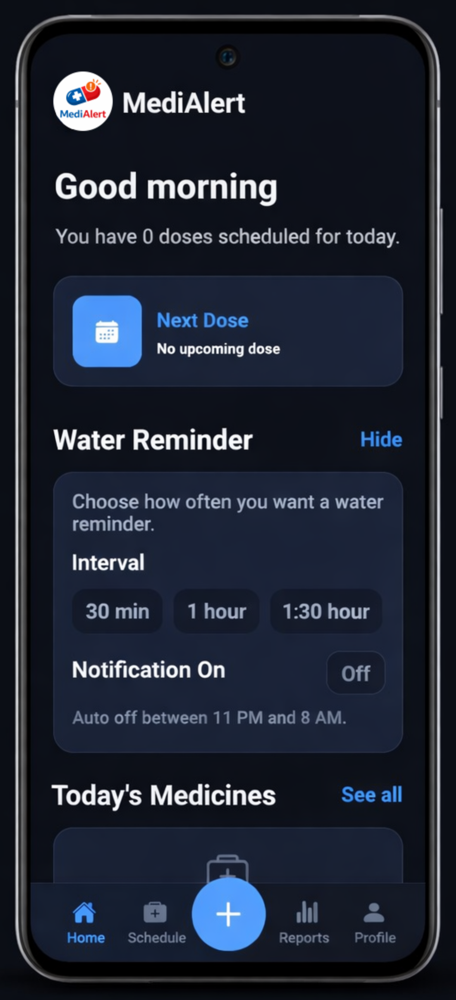
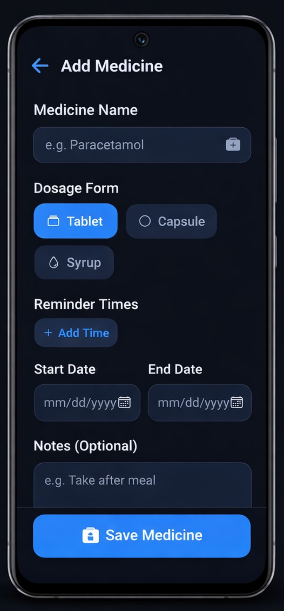
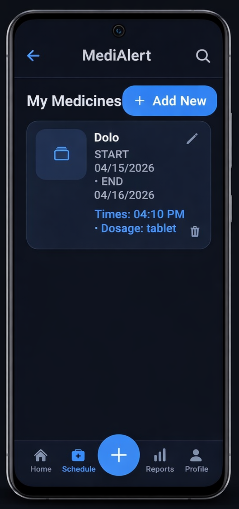
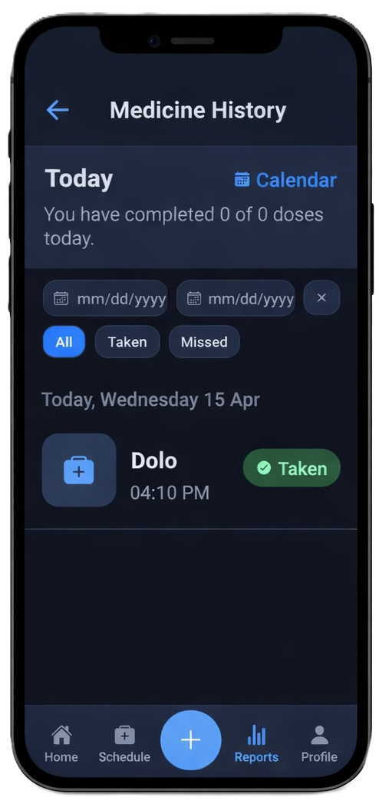
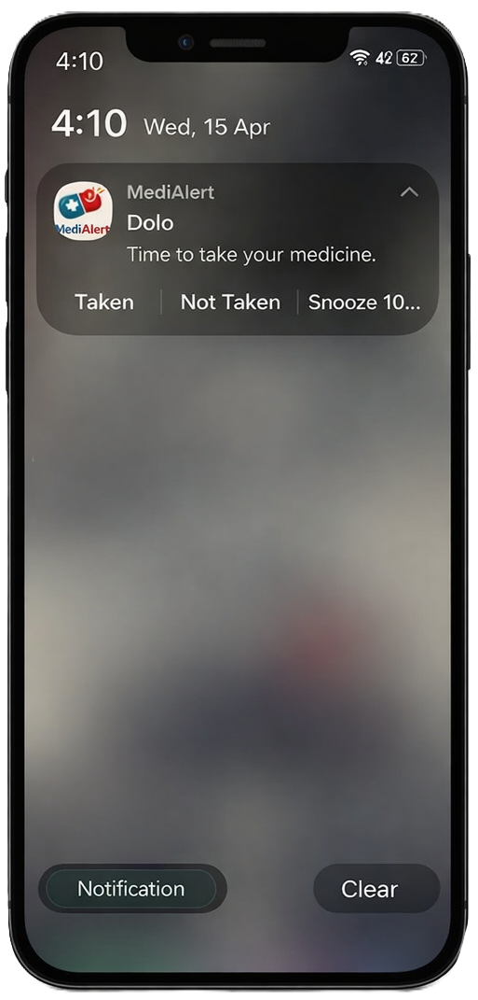

# MediAlert

<p align="center">
  
</p>

## Download App

You can download the app directly from Google Drive:

- [Download MediAlert App](https://drive.google.com/file/d/1GNZ0ivnubOtt2pQWctRwVZt-4Fr1ixXc/view)

## Project Overview

MediAlert is a medicine reminder application for people who need help staying on schedule, including elderly users, patients on multiple prescriptions, and caregivers managing daily routines. It keeps medication timing, intake tracking, and hydration alerts in one simple mobile application.

The system is built to feel practical in day-to-day use: add a medicine once, get notified at the right time, mark it as taken, and review the history later without extra steps.

## Screenshots

<table>
  <tr>
    <td align="center">
      
      <br />
      <sub>Splash / Branding</sub>
    </td>
    <td align="center">
      
      <br />
      <sub>Home Dashboard</sub>
    </td>
    <td align="center">
      
      <br />
      <sub>Add Medicine</sub>
    </td>
  </tr>
  <tr>
    <td align="center">
      
      <br />
      <sub>Medicines List</sub>
    </td>
    <td align="center">
      
      <br />
      <sub>History and Filters</sub>
    </td>
    <td align="center">
      
      <br />
      <sub>Reminder Notification</sub>
    </td>
  </tr>
</table>

## Features

- Helps users set up medicine reminders with start date, end date, and multiple daily times
- Shows what needs to be taken today, what is coming next, and what has already been completed
- Lets users edit or remove a medicine whenever the prescription changes
- Tracks taken and missed doses in a history view with date filters
- Includes a water reminder option for users who need hydration nudges during the day
- Supports light and dark themes for comfortable daily use

## Tech Stack

- React Native 0.84
- React 19
- React Navigation
- AsyncStorage
- Notifee
- `@react-native-community/datetimepicker`
- React Native Vector Icons

## Setup

### Prerequisites

- Node.js 22 or newer
- Android Studio or Xcode
- CocoaPods for iOS

### Install

```sh
npm install
```

### Start the app

```sh
npm start
```

### Run on Android

```sh
npm run android
```

### Run on iPhone / iOS simulator

```sh
bundle install
bundle exec pod install
npm run ios
```

## Notes

- All medicine data is stored locally on the device
- Notification reminders are scheduled per medicine time
- The home screen also includes a quick water reminder control
